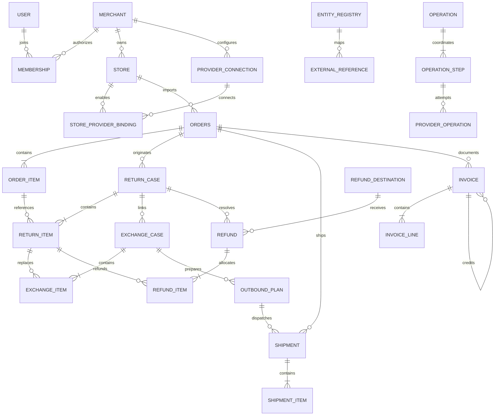
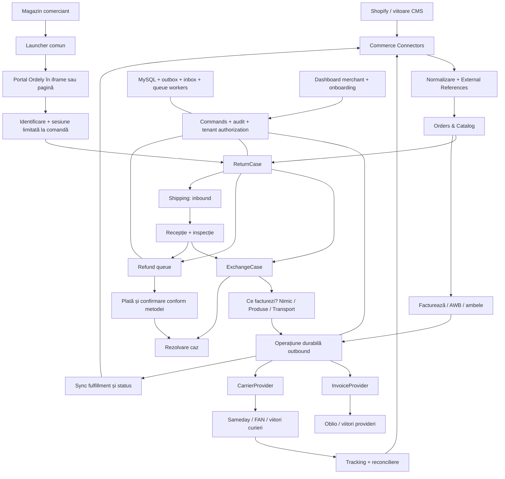

# Ordely — Plan de arhitectură

## Reguli acceptate — 2026-09-30

D01 — reguli de produs acceptate: diferența de preț la schimb se introduce manual, fără compensare automată. Bifa Transport preia tariful configurat în site și facturează pe datele inițiale ale clientului; AWB se generează automat cu COD egal cu diferența manuală plus transportul selectat. Nimic/total zero la schimb sau retrimitere înseamnă fără factură nouă/COD 0; regula nu elimină factura unei comenzi obișnuite deja plătite.

Storno automat numai la înregistrarea unui refuz de primire, pe original verificat; returul obișnuit nu declanșează storno. Facturile externe se acceptă numai după identificare/verificare în Oblio; original neverificabil blochează storno. Refuzul repetat nu dublează storno; rezultat necunoscut cere reconciliere conform D11. Planul nu avea un modul distinct pentru refuzuri: fluxul este păstrat în backlog-ul 16, corelat cu tracking/recepție, fără implementarea lui acum.

D04 — gestiunea stocului, reintegrarea, ajustările și rezervările sunt amânate explicit pentru o zonă separată. Oblio va emite fără modificări de stoc; citirea disponibilității rămâne separată. Email și SPV fără trimitere automată în etapa de test, acceptat. Mediul de emitere D08, validarea fiscală și probele reale de emitere/storno rămân restante. Aceste decizii actualizează propunerile istorice de mai jos; nu certifică providerul.

Reluare: 09.2a.2 — date complete și lista lipsurilor; 09 rămâne singurul modul activ. Schimbare numai documentară; fără emitere sau teste runtime rerulate.


Versiune 0.1 · 2026-09-27 · Modul 01 · **Direcție acceptată pentru continuare; detaliile deschise rămân în registrul de decizii**.

Documentul urmează, în ordine, cele 30 de livrabile din [brief](brief-original.md). Regulile explicite din brief sunt cerințe; alegerile de implementare de mai jos sunt propuneri. Deciziile încă deschise au ID în [registru](decisions.md). Scopul este un monolit modular PHP, cu MySQL, UI HTML/CSS/JavaScript nativ și adaptoare în afara Core-ului.

## 01. Domain model complet

Merchant este tenant-ul contractual. Un Merchant are utilizatori prin Membership, unul sau mai multe Stores și conexiuni la furnizori. Store identifică magazinul sursă, moneda implicită, setările operaționale, politica de retur și branding-ul. ProviderConnection păstrează conexiunea criptată; o asociere explicită decide în ce Store poate fi folosită.

UnifiedOrder este modelul intern al comenzii. Păstrează identitatea sursei prin ExternalReference, liniile, cantitățile, reducerile, taxele, moneda, starea plății și snapshot-urile clientului/adreselor. Nu conține un obiect Shopify. Customer și catalogul sunt proiecții normalizate; istoricul comenzii nu se schimbă când clientul își modifică profilul ori un produs este șters.

Order poate avea mai multe Shipments și Invoices. Shipment descrie un transport fizic, cu direcție și scop: INITIAL, RETURN, EXCHANGE_OUTBOUND, RESEND. AWB-ul, eticheta și încercările providerului aparțin transportului. OutboundShipment este o specializare de business a Shipment, cu un OutboundPlan de produse/transport și preț; nu este o a doua copie a AWB-ului.

ReturnCase gestionează aprobarea, logistica inbound, recepția și inspecția. ReturnItem referă obligatoriu un OrderItem, cantitatea și rezoluția dorită. ExchangeCase referă ReturnCase și liniile sale, plus replacement items și outbound shipments. Nu creează o a doua rezervare de retur pentru aceleași produse. Un retur poate conține simultan linii pentru bani și linii pentru schimb.

Refund reprezintă obligația de rambursare, nu factura storno și nici COD-ul. RefundDestination conține destinația criptată. Invoice și CreditNote reprezintă documentele emise de operatorul extern. TrackingEvent este o observație despre transport; nu este dovada că operatorul a inspectat produsul și nici că banii au fost rambursați.

Operation coordonează acțiuni care traversează mai multe agregate/provideri. OutboxEvent, WebhookEvent, Job și AuditEntry asigură livrarea, procesarea și trasabilitatea. Un eșec al curierului după emiterea facturii lasă o operațiune reluabilă, fără să pretindă un rollback al facturii externe.

Invariante centrale:

- Orice obiect operațional aparține unui merchant și, când este legat de o comandă, aceluiași store și aceleiași comenzi.
- Comanda, produsele, clientul și transporturile au ID-uri interne; ID-urile externe sunt mapări, niciodată chei de autorizare.
- Cantitățile returnate/reținute în cazuri active nu depășesc cantitatea eligibilă cumpărată. Eliberarea unei rezervări la anulare este atomică.
- Înlocuitorul solicitat se distinge de produsul facturat: un schimb gratuit are totuși conținut fizic, greutate și valoare declarată, chiar dacă COD este zero.
- Sumele se calculează pe server, în aceeași monedă; orice schimbare de preț/stoc invalidează oferta veche și cere reconfirmarea rezultatului de business.
- Totalul rambursărilor confirmate și rezervate nu depășește suma eligibilă încasată, după reduceri și rambursări deja existente.
- Nu deducem rambursarea unei plăți dintr-un storno sau dintr-un AWB livrat.

## 02. Bounded contexts și limite de module

| Context | Deține | Colaborează prin |
| --- | --- | --- |
| Identity & Tenancy | Merchant, User, Membership, Store, roluri | TenantContext, policy de autorizare |
| Integrations | ProviderConnection, registry, ExternalReference, cursori sync | Contracte și connection resolver |
| Orders & Catalog | UnifiedOrder, OrderItem, Customer, Product/VariantReference | Query services, snapshots, OrderImported |
| Shipping | Shipment, ShipmentItem, Pickup, TrackingEvent | CarrierProvider, ShipmentCreated/StatusChanged |
| Returns | ReturnCase, ReturnItem, ReturnPolicy, recepție/inspecție | OrderEligibility, Shipping, ReturnReceived |
| Exchanges | ExchangeCase, ExchangeItem, OutboundPlan, calcul încasări | Catalog queries, ReturnReceived, Shipping/Invoices |
| Invoicing | Invoice, InvoiceLine, credit notes | InvoiceProvider și politici de calcul |
| Refunds | Refund, RefundDestination, evidență confirmare plată | ReturnInspected, ordin de rambursare |
| Portal | Branding, identificare, PortalSession | Comenzi/queries autorizate către Returns/Exchanges |
| Operations | Operațiuni durabile, audit, joburi, outbox, dashboard read models | Commands, events și proiecții |

Contextul își deține scrierile. Un modul nu modifică direct tabelele altuia; folosește handlerul sau portul intern. Proiecțiile pentru dashboard pot citi date normalizate cu filtrare tenant. Nu pornim cu microservicii sau event sourcing; evenimentele notifică schimbările, iar starea curentă rămâne în MySQL.

## 03. Entități și value objects

Entități suplimentare celor din brief: Membership, StoreProviderBinding, ReturnPolicyVersion, Pickup, TrackingEvent, OutboundPlan, Operation, OperationStep, ProviderOperation, IdempotencyRequest, OutboxEvent, EventDelivery, SyncCursor, PortalSession și VerificationChallenge. Ele acoperă autorizarea, erorile parțiale, reconcilierea și reluarea sigură.

Value objects:

| Obiect | Reguli |
| --- | --- |
| MerchantId, StoreId, OrderId și celelalte ID-uri | Imutabile, tipate; prefixul public este doar prezentare |
| Money | `minor_amount` întreg + cod monedă; fără float; conversie explicită la provider |
| Quantity | Întreg pozitiv în V1; produse fracționare rămân în afara V1 |
| TaxRate, DiscountAllocation, PriceBreakdown | Precizie decimală fixă, reguli explicite de rotunjire |
| Address, CustomerSnapshot, CompanyDetails | Snapshot validat, cu câmpuri necesare scopului |
| ProductSnapshot, VariantSnapshot | Titlu/SKU/opțiuni/preț la momentul operațiunii |
| TrackingNumber, ServiceCode | Identificatori opaci, fără presupuneri despre formatul furnizorului |
| ShipmentDimensions, Weight | Unități explicite și valori pozitive |
| Iban, MaskedIban | Normalizare, structură/checksum; checksum-ul nu dovedește titularul |
| IdempotencyKey, CorrelationId | Scope și dimensiune limitate; fără PII |
| CapabilitySet | Funcții disponibile și restricții per cont/serviciu/destinație |
| PageCursor, DateRange, ProviderError | Tipuri interne, nu obiecte SDK |
| BillingSelection, OutboundQuote | Nimic/produse/transport, versiune și expirare, calcul numai server-side |

V1 propus: operațiuni în RON, structură pregătită pentru alte monede; nu efectuăm conversii valutare implicite. Sumele originale importate se păstrează cu moneda lor și sunt blocate pentru operațiuni incompatibile până la configurarea explicită.

## 04. Aggregate roots

| Root | Conținut controlat tranzacțional | Limită/invariantă |
| --- | --- | --- |
| Merchant | Setări tenant; Membership are administrare explicită | Niciun acces fără membership/actor valid |
| Store | Branding, policy versions, bindings | Conexiuni numai din același merchant |
| ProviderConnection | Secret version, status, settings | Secretul nu este returnat către UI |
| UnifiedOrder | OrderItems și snapshots | Import concurent unic; versioning la actualizare |
| ReturnCase | ReturnItems, recepție/inspecție | Cantități aprobate și inspectate urmărite pe linie |
| ExchangeCase | ExchangeItems, replacement și politica aleasă | Legătura original → inbound → outbound rămâne completă |
| OutboundPlan | Selecție facturare, linii, quote acceptat | Nu se modifică după emitere fără versiune nouă |
| Shipment | Items, colete, tracking normalizat | Un AWB per intenție; mai multe expediții legitime au intenții distincte |
| Pickup | Shipment associations și programare | Programarea nu este confirmată doar prin crearea AWB-ului |
| Invoice | InvoiceLines și alocări către documentul original | Totalul se verifică cu răspunsul providerului |
| Refund | Sume, destinație, confirmare și încercări | Fără dublă plată; confirmare externă/evidență obligatorie |
| Operation | Pași și corelații | Reia pasul neterminat, fără repetarea pașilor confirmați |

Customer/catalog sunt roots de proiecție, fără autoritate peste snapshots istorice. RefundDestination este un root securizat referit de Refund, cu acces și retenție distincte. Job, WebhookEvent și OutboxEvent sunt înregistrări infrastructurale, nu agregate comerciale.

Agregatele păstrează ID-uri către alte roots. Când rezervarea cantității sau sumei cere coordonare în aceeași bază, un application service utilizează o tranzacție scurtă și lock pe linia de comandă/balanță; nu încarcă un întreg „Merchant aggregate”.

## 05. State machines

Tranzițiile sunt metode/comenzi validate, cu actor, motiv și `expected_version`. Nu permitem PATCH arbitrar al `status`. O eroare temporară de API ține de ProviderOperation; nu transformă automat un transport livrat sau o factură emisă în FAILED.

### Shipment

`DRAFT → CREATION_PENDING → LABEL_CREATED → PICKUP_SCHEDULED → IN_TRANSIT → DELIVERED`.

- `LABEL_CREATED → IN_TRANSIT` este permis când nu se programează pickup în Ordely.
- Cererea poate ajunge în `CREATION_FAILED`; retry explicit → `CREATION_PENDING` doar dacă știm că nu există AWB extern.
- Timeout după trimitere → operațiune `UNKNOWN`, Shipment rămâne pending până la reconciliere; nu reemitem orbește.
- Anularea: `DRAFT → CANCELLED`; după AWB, cerere `CANCELLATION_PENDING → CANCELLED` numai la confirmarea curierului. Refuzul restaurează starea logistică cunoscută.
- `IN_TRANSIT → EXCEPTION → IN_TRANSIT/DELIVERED/RETURNED_TO_SENDER/LOST`.
- Statusuri întârziate nu retrogradează `DELIVERED`; o corecție validată are eveniment/audit separat. Istoricul brut normalizat rămâne disponibil.

### ReturnCase

`REQUESTED → APPROVED → AWB_CREATED → PICKUP_SCHEDULED → IN_TRANSIT → RECEIVED → INSPECTED → RESOLVED`.

- `REQUESTED → REJECTED/CANCELLED`; `APPROVED → CANCELLED` numai după eliberarea rezervărilor și rezolvarea AWB-urilor existente.
- Retur predat personal: `APPROVED → RECEIVED`. Pickup nefolosit: `AWB_CREATED → IN_TRANSIT`.
- Livrare curier la depozit propune „de recepționat”; `ReceiveReturn` confirmă recepția fizică și cantitățile.
- `RECEIVED` se atinge când cantitățile așteptate sunt recepționate sau discrepanța este închisă explicit; recepțiile parțiale rămân pe linii și în audit.
- `INSPECTED` cere verdict per linie. `RESOLVED` cere toate rezoluțiile finalizate: refund confirmat, schimb finalizat ori respingere justificată. Returul nu dispare din dashboard după emiterea AWB-ului.
- Starea nu ține locul detaliilor pentru multiple AWB-uri; acestea rămân în Shipping.

### ExchangeCase

`REQUESTED → APPROVED → AWAITING_RETURN → READY_FOR_OUTBOUND → OUTBOUND_PENDING → OUTBOUND_SHIPPED → COMPLETED`.

- V1 din brief: `ReceiveReturn` poate declanșa `READY_FOR_OUTBOUND`. Politica dacă este obligatorie și inspecția se fixează la D03.
- În `READY_FOR_OUTBOUND` stocul și quote-ul se revalidează. Lipsa stocului produce un blocaj operațional, nu o expediere imaginară.
- `OUTBOUND_PENDING` include factură și AWB; eșecul unui pas păstrează rezultatele confirmate ale celuilalt.
- `COMPLETED` cere livrarea outbound și îndeplinirea obligației inbound; o excepție poate necesita închidere manuală motivată.
- `CANCELLED` este permis înainte de efecte externe sau după compensări explicite. `REJECTED` este permis din REQUESTED.
- „Colet la schimb” este un mod logistic separat: outbound poate porni din APPROVED doar când carrier capability este confirmată și fluxul cere colectarea inbound la livrare. Nu îl combinăm automat cu inbound deja primit; sunt rute alternative, decise la D03.

### Refund

`NOT_REQUIRED` pentru o rezoluție fără rambursare; altfel `PENDING → READY_FOR_REFUND → PROCESSING → REFUNDED`.

- READY cere inspecție/decizie, sumă eligibilă și destinație validă când este transfer bancar.
- `PROCESSING → FAILED` doar când eșecul este cert; retry explicit poate reveni în READY.
- Rezultat incert → `RECONCILIATION_REQUIRED`; un alt operator nu poate plăti din nou până la clarificare.
- `CANCELLED` doar înainte de plata confirmată și cu eliberarea rezervării sumei. REFUNDED este terminal; o rectificare este o operațiune separată.
- Recomandare V1: coadă + plată externă efectuată de comerciant + confirmare cu referință, sumă și dată. Nu promitem transfer bancar automat printr-un simplu click; mecanismul se decide la D02.

### Invoice

`DRAFT → ISSUANCE_PENDING → ISSUED`; eșec cert → `ISSUANCE_FAILED`; rezultat incert se reconciliază înainte de retry.

- `DRAFT → CANCELLED` local. Anularea documentului emis este o acțiune distinctă, numai dacă providerul și politica o permit; status final CANCELLED după confirmare.
- Storno: document separat `type=CREDIT_NOTE`, cu aceeași mașină de emitere și referință la original. Documentul original rămâne ISSUED, cu `credit_status=NONE/PARTIAL/FULL` derivat din storno confirmate.
- Trimiterea emailului/PDF-ului și încasarea nu sunt stări de emitere. Au rezultate și audit separat.

## 06. CommerceConnector contract

Contractele sunt interne Ordely. Mai jos sunt semnături conceptuale, nu fișiere PHP implementate. `ctx` este ConnectorContext rezolvat server-side: merchant, store, connection ID și correlation ID; secretele sunt injectate exclusiv în adaptor.

| Operație | Intrare → rezultat intern |
| --- | --- |
| capabilities | ctx → CommerceCapabilities |
| getOrder / getOrders | ExternalOrderId / OrderFilter + PageCursor → UnifiedOrderSnapshot / Page<OrderSnapshot> |
| getCustomer | ExternalCustomerId → CustomerSnapshot |
| getProducts / searchProducts | filtre / query + cursor → Page<ProductSnapshot> |
| getProduct / getVariants | ProductReference + cursor unde este necesar → ProductSnapshot / Page<VariantSnapshot> |
| getInventory | VariantReferences + LocationScope → InventorySnapshot cu observedAt |
| createFulfillment | FulfillmentRequest + OperationKey → FulfillmentResult |
| updateTracking | FulfillmentReference + TrackingUpdate + OperationKey → SyncResult |
| updateOrder | OrderReference + OrderChangeSet + OperationKey → OrderSnapshot |
| addOrderMetadata | OrderReference + lista cheilor Ordely permise + OperationKey → SyncResult |
| createReturn / updateReturn | ReturnExport / ReturnChangeSet + OperationKey → ExternalReturnResult |
| registerWebhooks | DesiredSubscriptions → RegistrationReport |

Facade-ul CommerceConnector compune porturi mici: OrderReader, CatalogReader, FulfillmentWriter, OrderWriter, ReturnWriter, WebhookRegistrar. O platformă care nu poate edita comenzi declară lipsa capabilității; nu implementăm metode care întorc succes fals. Query-urile folosesc paginare și limite, nu returnează întregul catalog într-un request.

Capabilities propuse: readOrders, readCustomer, readCatalog, readInventory, writeFulfillment, writeTracking, editOrder, writeMetadata, nativeReturns. Nu presupunem că toate CMS-urile oferă retur nativ. ReturnCase Ordely funcționează independent; sincronizarea nativă este un efect opțional urmărit separat.

`OrderChangeSet` permite doar operațiile definite explicit și suportate; nu primește JSON arbitrar Shopify. FulfillmentRequest include mapări de linii, cantități și locație; adaptorul traduce spre modelul de fulfillment al platformei. Identificarea clientului rămâne în Ordely: adaptorul livrează datele autorizate, nu gestionează sesiunea browserului.

Orice apel extern întoarce rezultat tipat ori ProviderError: category, retryable, retryAfter, safeMessageKey, providerRequestId și un diagnostic securizat. SDK exceptions nu trec în Domain.

## 07. CarrierProvider contract

| Operație | Intrare → rezultat |
| --- | --- |
| capabilities | ConnectionContext + destinație/serviciu → CarrierCapabilities |
| getServices / calculateRate | ShippingContext / RateRequest → ServiceOptions / RateQuote |
| createShipment | ShipmentRequest + OperationKey → ShipmentResult |
| createReturnShipment | ReturnShipmentRequest + OperationKey → ShipmentResult |
| cancelShipment / getShipment | ShipmentReference [+ OperationKey la anulare] → CancellationResult / ShipmentSnapshot |
| getLabel | ShipmentReference + format → document temporar accesibil server-side |
| getTracking | ShipmentReferences → TrackingSnapshot[] |
| createPickup / cancelPickup | PickupRequest / PickupReference + OperationKey → PickupResult |
| getPickupPoints | GeoFilter + cursor → Page<PickupPoint> |

ShipmentRequest conține expeditor, destinatar, colete, conținut, serviciu, COD Money, valoare declarată separată, clientReference și parcelExchange. Returul are destinatarul/expeditorul inversate prin model, nu prin presupuneri în UI.

Capabilities: supportsCOD, supportsPickup, supportsReturnShipment, supportsParcelExchange, supportsLocker, supportsPickupPoints, supportsMultiplePackages; suplimentar monede/formate/limite/zone și suportul pentru idempotency sau lookup prin clientReference.

Capabilitățile depind de furnizor, contractul comerciantului, serviciu și destinație. UI le afișează, iar backend-ul le verifică din nou. Sameday/FAN nu sunt marcate implicit ca suportând toate funcțiile; se completează o matrice pe baza API-ului și conturilor reale în modulele 10–11.

## 08. InvoiceProvider contract

| Operație | Intrare → rezultat |
| --- | --- |
| capabilities | ctx → InvoiceCapabilities |
| createInvoice | InvoiceDraft + OperationKey → IssuedInvoice |
| cancelInvoice | InvoiceReference + reason + OperationKey → CancellationResult |
| createCreditNote | OriginalInvoiceReference + CreditLines + reason + OperationKey → IssuedCreditNote |
| getInvoice / getPdf | InvoiceReference → InvoiceSnapshot / document securizat |
| sendInvoice | InvoiceReference + destinatar validat + OperationKey → DeliveryResult |

InvoiceDraft include seller profile, customer/billing snapshot, linii, cantități, prețuri, taxe, reduceri, monedă, serie configurată și referință business. Providerul rămâne autoritatea pentru numărul și documentul emis. Liniile și totalul calculate de Ordely se compară cu răspunsul real; o diferență blochează generarea AWB până la reconciliere.

Implementare incrementală 09.2a.1 (D22): `invoice_profiles` păstrează o selecție criptată de firmă/serie per merchant/store, cu FK spre magazin/conexiune invoice, CAS și audit fără conținut fiscal. AAD include merchant/store/conexiune/versiuni. Schimbarea versiunii/asocierii conexiunii cere reverificare; salvarea citește nomenclatoarele și revalidează contextul după rețea. Selecția nu este încă seller snapshot complet și nu autorizează emiterea; datele de adresă/destinatar/linii și snapshot-ul imutabil al documentului rămân în restul 09.2a.

Capabilities includ storno parțial, anulare, PDF, trimitere și căutarea unei operațiuni. Stornarea unei facturi inițiale emise în alt sistem necesită o referință verificată; nu inventăm factura originală. Oblio este primul adaptor. Ordely nu ține contabilitate și nu clasifică o regulă de produs ca validare fiscală.

## 09. Event model

Un DomainEvent este un fapt trecut. Envelope: `event_id`, `event_type`, `schema_version`, `merchant_id`, `store_id` unde este relevant, `aggregate_type`, `aggregate_id`, `aggregate_version`, `occurred_at_utc`, `actor_ref`, `correlation_id`, `causation_id`, `payload` minim fără secrete.

Starea agregatului, auditul și evenimentul outbox se scriu în aceeași tranzacție. Dispatcher-ul livrează cel puțin o dată. Fiecare consumer deduplică `(event_id, consumer_name)` și își salvează efectul și deduplicarea atomic. Handlerii tolerează întârzierea/repetarea; versiunea este per agregat, fără ordine globală garantată.

Evenimente V1: ORDER_IMPORTED, ORDER_UPDATED, INVOICE_CREATED, INVOICE_CREDITED, SHIPMENT_CREATED, SHIPMENT_STATUS_CHANGED, RETURN_REQUESTED, RETURN_APPROVED, RETURN_RECEIVED, RETURN_INSPECTED, RETURN_RESOLVED, EXCHANGE_CREATED, EXCHANGE_READY_FOR_OUTBOUND, OUTBOUND_SHIPMENT_CREATED, REFUND_READY, REFUND_COMPLETED, PROVIDER_CONNECTION_REVOKED și OPERATION_REQUIRES_ATTENTION.

Payload-ul include ID-uri și diferențele necesare consumerului. Nu retransmite întregul webhook, IBAN sau credentials. Schimbările incompatibile au versiune nouă și converter/consumer compatibil pe perioada de migrare. Evenimentele nu sunt sursa unică a adevărului financiar.

## 10. Command model

Command exprimă o intenție și are un handler responsabil. Envelope: command ID, tip, actor autentificat, TenantContext verificat, expectedVersion, idempotency key, correlation ID și DTO validat.

| Command | Efect principal / condiție |
| --- | --- |
| ImportOrder / ReconcileOrders | Upsert normalizat; versiune externă mai nouă, fără retrogradare |
| CreateInvoice / CreateCreditNote | Rezervă intenția, emite o singură dată și persistă rezultatul |
| CreateShipment / CancelShipment | Verifică eligibilitate/capabilities și OperationKey |
| InvoiceAndShipOrder | Operation cu pași factură → AWB → sync CMS |
| RequestReturn / ApproveReturn / RejectReturn | Politică versionată și rezervare atomică a cantităților |
| CreateReturnShipment / SchedulePickup | AWB și pickup distincte, reluabile |
| ReceiveReturn / InspectReturn | Cantități/verdict per linie, actor operator |
| CreateExchange / QuoteExchangeOutbound | Înlocuitor și selecție facturare; quote imutabil |
| CreateExchangeOutbound / CreateResend | Revalidare quote/stoc și orchestrarea efectelor |
| PrepareRefund / ProcessRefund / ConfirmRefund | Sumă eligibilă, rezervare și dovadă plată |
| SyncTracking / SyncCommerceStatus | Sincronizare idempotentă, fără bucle import-export |

Commands nu sunt executate prin EventBus ca și cum ar fi fapte deja produse. Query-urile nu au efecte comerciale. Comenzile rapide returnează rezultatul; comenzile cu efecte externe returnează Operation ID și status de urmărit.

## 11. Workflow-uri principale

### Instalare și import

Install → identitate merchant/store → connection criptată → webhooks → import inițial paginat → reconciliere incrementală. Upsert-ul folosește ExternalReference. Order snapshot se salvează cu outbox/audit. Modificările ulterioare ale comenzii nu rescriu facturi și expedieri deja confirmate.

### Comandă normală

Operatorul poate factura, expedia sau alege acțiunea combinată. Pentru „Facturează + AWB”: snapshot comandă → intenție factură → confirmare provider → verificare total → AWB → fulfillment/tracking CMS. Dacă AWB eșuează, factura rămâne legată de Operation și se reia doar AWB. Dacă sync CMS eșuează, nu reemităm AWB-ul.

**COD-ul unei comenzi obișnuite depinde de soldul de încasat și metoda de plată. O comandă deja plătită poate avea factură și COD 0. Regula COD = factura nouă din brief se aplică outbound-ului de schimb/retrimitere, nu tuturor comenzilor.**

### Retur pentru bani

Identificare → eligibilitate per linie → motiv + destinație plată dacă este necesară → ReturnCase → aprobare → AWB retur → pickup → tracking → recepție operator → inspecție → READY_FOR_REFUND → plată externă/confirmare → REFUNDED → RESOLVED când toate liniile sunt închise. Conform D01 acceptat la 2026-09-30, returul obișnuit nu declanșează storno; înregistrarea unui refuz de primire îl declanșează automat pe original verificat, fără duplicate și cu reconciliere la rezultat necunoscut.

ReturnPolicy fixează eligibilitatea, motivele, termenul configurat și taxele; nu hardcodăm o afirmație juridică universală. Cererea păstrează versiunea politicii acceptate. Storno și plată sunt pași independenți, corelați.

### Schimb și retrimitere

ReturnCase + ExchangeCase → alegere produs/variantă disponibilă → inbound → ReceiveReturn → READY_FOR_OUTBOUND → quote → confirmare operator → factură dacă este cazul → AWB → sync CMS → livrare. Pentru colet la schimb se folosește ruta alternativă definită în §05 și D03.

| Selecție operator | Factură nouă V1 | COD outbound | Conținut fizic |
| --- | --- | --- | --- |
| Nimic | Nu | 0 | Înlocuitorul/retrimiterea configurată |
| Transport | Linie transport, ex. 1 × 19 RON | 19 RON | Înlocuitorul configurat |
| Produse | Liniile alese, ex. 129 RON | 129 RON | Liniile de expediat validate |
| Produse + transport | Ex. 129 + 19 = 148 RON | 148 RON | Liniile de expediat validate |

Nimic este exclusiv; produsele și transportul pot fi combinate. Operatorul nu introduce COD. Quote-ul include reduceri/taxe/rotunjire și totalul; în V1 încasarea acestui outbound este ramburs. Plata anticipată sau compensarea diferențelor sunt extinderi prin policy, nu reguli ascunse. Total zero cu linii selectate și tratamentul diferenței de preț trebuie decise înainte de modulul 19 (D01).

`CreateResend` referă comanda și expedierea inițială, un motiv și un nou OutboundPlan; poate exista fără retur. Nu reutilizează cheia idempotency a expedierii originale. Prețurile, variantele și cantitățile vin din catalog normalizat; stocul se recitește înainte de efecte. Dacă CMS nu oferă rezervare, UI spune că disponibilitatea este verificată, dar nu garantată între verificare și expediere; se definește alternativa la D04.

## 12. Arhitectura widget-ului

Un singur launcher versionat, un singur portal găzduit de Ordely. Store public token identifică branding-ul; **nu autorizează citirea unei comenzi**. Scriptul deschide overlay cu iframe de pe origin Ordely, plus link fallback către aceeași pagină în top-level. Theme/plugin-ul fiecărui CMS doar inserează launcher-ul.

Flux browser: bootstrap branding public → POST pentru identificare Order ID + email/telefon → verificare în contextul store-ului, prin date normalizate/connector → sesiune temporară limitată la merchant/store/order și acțiunile permise → selecție eligibilă → submit idempotent. OTP poate fi cerut înainte de dezvăluirea datelor în funcție de policy; recomandat pentru risc crescut și obligatoriu dacă acesta este modelul de securitate aprobat la D05.

Tokenul de sesiune este aleator, scurt ca durată, ținut în memoria iframe-ului; hash server-side, expirare, revocare și rate limit. Reîncărcarea poate cere identificare din nou. Nu depindem de cookies third-party, nu salvăm bearer tokens în URL/logs și nu trimitem tokenul portalului către launcher.

`postMessage` comunică doar ready/resize/close și date publice validate; verifică atât origin exact, cât și source și schema. Nu folosim `*` pentru mesaje sensibile. CSP frame-ancestors permite domeniile magazinului verificate; navigarea directă rămâne suportată. API-ul portalului rulează pe același origin cu iframe-ul; nu deschidem CORS wildcard cu credentials.

White-label: logo din stocare controlată, culori validate, gradient, radius limitat, titlu/texte și politică sanitizată. Fără CSS/JS arbitrar configurabil. Focus trap, Escape, scroll, mobile și accesibilitate verificate. Răspunsurile de identificare nu confirmă separat existența comenzii/emailului. IBAN complet este vizibil doar în rolul și pasul care necesită plata.

## 13. Arhitectura multi-tenant

Propunere V1: bază MySQL comună, shared schema, `merchant_id` obligatoriu pentru datele tenant-ului. `store_id` se propagă pe comenzi/cazuri/documente/transporturi. User poate avea memberships în mai mulți merchants; store access poate fi restrâns prin membership-store grants.

TenantContext se construiește din autentificarea verificată, nu din `merchant_id` primit în body. La Shopify, shop validat → Store → Merchant; la webhook, semnătură și connection verificată → tenant; la worker, job verificat → tenant și conexiune curentă. După dezinstalare/dezactivare, operațiunile de business sunt oprite; operațiunile de cleanup pot continua cu policy dedicată.

Repository interfaces cer TenantContext explicit, inclusiv la `getById`. FK-uri compuse protejează relațiile între tenants, iar verificările de store/order protejează relațiile mai fine. MySQL nu înlocuiește aceste verificări cu o presupusă izolare automată la nivel de rând. Jobs, caches, storage keys, log queries și exports includ scope-ul tenant.

Adminul platformei folosește acces separat, auditat, cu motiv, fără „tenant implicit”. Un public store token divulgat nu oferă acces administrativ. Testele negative folosesc cel puțin doi tenants cu ID-uri externe similare.

## 14. MySQL ERD și schema propusă

Aceasta este o schemă logică pentru migrațiile viitoare, nu DDL executat. Propunere: MySQL 8.4/InnoDB, UTF-8, timp UTC cu `DATETIME(6)`. PK intern `BINARY(16)` generat de aplicație; ID public reprezentat ca șir opac. Coloanele comune pentru entități: `id`, `merchant_id`, `created_at`, `updated_at`, iar pentru roots mutabile `version BIGINT UNSIGNED`. Tabelele tenant au `UNIQUE(merchant_id,id)` pentru FK-uri compuse, chiar dacă `id` este global unic.

`T` din tabel înseamnă coloanele comune tenant. `S` adaugă `store_id NOT NULL` și FK `(merchant_id,store_id) → stores(merchant_id,id)`. Statusurile sunt `VARCHAR(32)` validate prin CHECK și enum-uri PHP; modificarea stărilor necesită migrare. Money se persistă ca `BIGINT` în unități minore + `CHAR(3)` pentru monedă; taxe/rapoarte cu `DECIMAL`, niciodată DOUBLE.



Cardinalitățile 1..N exprimă obiecte valide de business; un draft incomplet poate avea temporar zero linii. Legăturile opționale descrise mai jos nu sunt toate desenate, pentru lizibilitate.

### Identitate și integrări

| Tabel | Coloane principale și relații |
| --- | --- |
| merchants | `id PK`, name, status, settings_json, created_at, updated_at |
| users | `id PK`, email_normalized UQ, password_hash nullable pentru SSO, status, timestamps; fără merchant implicit |
| memberships | T, user_id FK users, role, status; UQ `(merchant_id,user_id)` |
| membership_store_grants | merchant_id, membership_id, store_id; PK compus; FK-uri tenant către ambele |
| stores | T, platform_key, source_account_key, name, currency, timezone, status, archived_at; identitatea sursei unică pe platformă în instalările active |
| store_branding | merchant_id, store_id PK/FK compus, logo_asset_id, culori, radius, title, sanitized_text_json, version |
| return_policy_versions | S, policy_version, rules_json, published_at; UQ `(merchant_id,store_id,policy_version)`; versiune publicată imutabilă |
| provider_connections | T, type, provider_key, external_account_key, credentials_ciphertext, nonce, key_id, settings_json, status, revoked_at |
| store_provider_bindings | S, connection_id, purpose, is_default; FK tenant connection; UQ store/connection/purpose; un default per store/purpose |
| entity_registry | T, store_id nullable, entity_type; identitatea resurselor care pot fi mapate extern |
| external_references | T, connection_id FK tenant, entity_id FK registry, entity_type, external_id, reference_kind; unicitate externă în §15 |
| sync_cursors | S, connection_id, resource_type, watermark_at, cursor_json, lease_until; UQ store/connection/resource |

Store păstrează identitatea publică a platformei, nu credentials. `entity_registry` și rândul concret se creează în aceeași tranzacție, cu același ID; tabelele mapate au FK tenant către registry. Tipul și existența subtype-ului se validează în repository; registry nu devine o scurtătură pentru autorizare. Migrațiile vor fixa discriminatorul per tip și vor testa integritatea mapărilor.

### Comenzi și catalog

| Tabel | Coloane principale și relații |
| --- | --- |
| customers | S, contact_ciphertext, key_id, contact_lookup_hmac, profile_snapshot_json; PII minim, retenție explicită |
| product_references | S, title, status, snapshot_json, source_updated_at, archived_at |
| variant_references | S, product_id FK tenant/store, sku, option_values_json, price_minor, currency, source_updated_at, archived_at |
| inventory_snapshots | S, variant_id, location_ref, available_qty, observed_at; UQ variant/location |
| orders | S, customer_id nullable, display_number, financial_status, fulfillment_status, currency, subtotal_minor, discount_minor, tax_minor, shipping_minor, total_minor, paid_minor, customer_snapshot_ciphertext, billing/shipping_snapshot_ciphertext, source_updated_at, imported_at |
| order_items | S, order_id FK tenant/store, product_id/variant_id nullable, line_key, quantity, unit_price_minor, discount_minor, tax_minor, total_minor, product_snapshot_json; UQ order/line_key |
| order_item_allocations | S, order_id, order_item_id, return_item_id, quantity, status; rezervări pentru retur; UQ return_item_id |

Snapshot-urile operaționale cu PII sunt criptate, cu nonce/key_id prin value object securizat; câmpurile enumerate generic ca ciphertext includ metadatele de decriptare. Hash-ul simplu de email nu este suficient pentru lookup protejat; folosim HMAC cu cheie separată și acces limitat. Display number nu este unic global.

### Logistica, retururi și schimburi

| Tabel | Coloane principale și relații |
| --- | --- |
| return_cases | S, order_id, policy_version_id, status, reason_summary, requested_at, approved_at, received_at, inspected_at, resolved_at, version |
| return_items | S, order_id, return_id, order_item_id, requested_qty, approved_qty, received_qty, accepted_qty, resolution_type, reason_code, inspection_result; un item de comandă poate fi împărțit în mai multe rezoluții cu alocare controlată |
| exchange_cases | S, order_id, return_id, status, logistics_mode, ready_at, completed_at, version |
| exchange_items | S, order_id, exchange_id, return_item_id, replacement_variant_id, quantity, replacement_snapshot_json |
| outbound_plans | S, order_id, exchange_id nullable, original_shipment_id nullable pentru retrimitere, reason, billing_selection, shipping_fee_minor, subtotal/tax/total_minor, currency, quote_version, expires_at, accepted_at, status |
| outbound_plan_items | S, outbound_plan_id, variant_id nullable, quantity, ship_item flag, bill_item flag, unit_price_minor, tax/discount/total_minor, snapshot_json |
| shipments | S, order_id, return_id nullable, exchange_id nullable, outbound_plan_id nullable, connection_id, intent_id, direction, purpose, status, service_code, tracking_number, cod_minor, currency, declared_value_minor, addresses_ciphertext, label_asset_id nullable, provider_status, parcel_exchange, shipped_at, delivered_at |
| shipment_items | S, order_id, shipment_id, order_item_id nullable, return_item_id nullable, outbound_plan_item_id nullable, quantity; exact un tip de sursă potrivit scopului |
| shipment_packages | S, shipment_id, sequence, weight_grams, length/width/height_mm, external_package_id; UQ shipment/sequence |
| pickups | S, connection_id, status, window_from/to, address_ciphertext, external_pickup_id |
| pickup_shipments | merchant_id, store_id, pickup_id, shipment_id; PK compus, FK-uri tenant/store |
| tracking_events | S, shipment_id, external_event_key, occurred_at, received_at, normalized_status, location_summary, safe_metadata_json; UQ shipment/event key |

Foreign keys mai stricte: root-urile dependente expun UQ `(merchant_id,store_id,order_id,id)`; de exemplu ReturnItem are FK către ReturnCase și OrderItem folosind același order_id. ExchangeCase trebuie să refere ReturnCase din aceeași comandă. Shipment cu exchange/return/outbound plan are aceleași FK-uri compuse. Constrângerile de cantitate între mai multe rânduri cer tranzacție/locking; un CHECK local nu le poate impune.

### Facturi și rambursări

| Tabel | Coloane principale și relații |
| --- | --- |
| invoices | S, order_id, outbound_plan_id nullable, connection_id, document_type, original_invoice_id nullable FK tenant, intent_id, status, credit_status, series, number, currency, net/tax/gross_minor, customer_snapshot_ciphertext, issued_at, pdf_asset_id nullable |
| invoice_lines | S, invoice_id, sequence, original_invoice_line_id nullable, source_kind, description, quantity, unit_price_minor, tax_rate_decimal, discount_minor, net/tax/gross_minor; UQ invoice/sequence |
| refund_destinations | S, customer_id nullable, method, holder_ciphertext, iban_ciphertext, iban_last4, nonce, key_id, verified_at, retired_at |
| refunds | S, order_id, return_id, destination_id nullable, method, currency, amount_minor, status, intent_id, payment_reference nullable, paid_at, confirmed_by nullable, version |
| refund_items | S, refund_id, return_item_id, quantity, amount_minor; alocă explicit rambursarea parțială |
| refund_reservations | S, order_id, refund_id, amount_minor, status; UQ refund_id; lock la calcularea soldului |
| refund_credit_notes | S, refund_id, invoice_id, amount_minor; PK compus; documentul trebuie să fie CREDIT_NOTE |

Un Refund poate avea mai multe documente storno și un document poate acoperi alocări definite, fără să echivaleze automat cu plata. OriginalInvoiceLine leagă cantitățile/sumele creditate, cu limită verificată tranzacțional. Datele bancare nu se duplică în payload-uri, audit sau invoice snapshots.

### Operațiuni, securitate și infrastructură

| Tabel | Coloane principale și relații |
| --- | --- |
| operations | S, type, business_key, status, correlation_id, result_refs_json, safe_error, actor_ref; UQ tenant/business_key |
| operation_steps | S, operation_id, step_name, status, result_entity_id, started_at, finished_at; UQ operation/step |
| provider_operations | S, operation_step_id, connection_id, operation_key, request_hash, state, lease_owner, lease_until, fencing_version, provider_reference, attempt_count, last_error_code; UQ tenant/connection/operation_key |
| idempotency_requests | S, actor_scope, route_scope, key_hash, request_hash, operation_id, status, safe_response_json, expires_at; UQ scope/key |
| webhook_events | T, connection_id, provider_key, delivery_id, topic, source_occurred_at, received_at, payload_ciphertext, key_id, status, error_code; UQ connection/delivery_id |
| outbox_events | T, store_id nullable, event_type, schema_version, aggregate_type/id/version, occurred_at, correlation_id, causation_id, payload_json, published_at |
| event_deliveries | merchant_id, event_id, consumer_name, status, processed_at; PK `(merchant_id,event_id,consumer_name)` |
| jobs | T, store_id nullable, type, payload_refs_json, status, available_at, lease_until, lease_owner, fencing_version, attempt_count, max_attempts, last_error_code, completed_at |
| job_attempts | T, job_id, attempt_number, started_at, ended_at, result, safe_error; UQ job/attempt |
| audit_logs | T, store_id nullable, actor_type/id, action, entity_type/id, occurred_at, correlation_id, safe_changes_json; append-only |
| portal_sessions | S, order_id, token_hash UQ, granted_actions_json, verified_level, expires_at, revoked_at |
| verification_challenges | S, order_id nullable, target_hmac, otp_hash, attempts, expires_at, consumed_at |
| private_assets | T, store_id nullable, entity_id, object_key UQ, mime, size, purpose, expires_at; download prin autorizare |

Tabelele infrastructurale păstrează date minime. Dead-letter este `jobs.status=DEAD` plus attempt history; requeue este comandă auditată. Joburile exclusiv de platformă au scope separat, nu `merchant_id` arbitrar nul care dezactivează filtrarea.

## 15. Indexes și constraints importante

- Toate FK-urile operaționale includ merchant; cele dependente de comandă includ store/order unde există risc de încrucișare. `ON DELETE RESTRICT` pentru comenzi, facturi, refunds și audit; ștergerea legală/retention se face prin job dedicat care păstrează minimul necesar conform politicii validate.
- `external_references`: UQ `(merchant_id,connection_id,entity_type,reference_kind,external_id)`; index invers `(merchant_id,entity_id,connection_id)`. External IDs folosesc comparație exactă, sensibilă la case. Lungimea suportată se fixează în contract, fără trunchiere tăcută.
- `stores`: identitate de platformă unică pentru instalarea activă; pentru soft delete folosim generated active key + UNIQUE sau registru de instalări active. Un `UNIQUE(...,deleted_at)` cu NULL nu impune singur regula dorită.
- `store_provider_bindings`: generated default slot care are valoare doar la `is_default=1`, UQ `(merchant_id,store_id,purpose,default_slot)`.
- `orders`: index `(merchant_id,store_id,source_updated_at,id)` pentru reconciliere și `(merchant_id,store_id,created_at,id)` pentru listare; numărul afișat se caută în store.
- `returns/exchanges/refunds/shipments/invoices`: index `(merchant_id,store_id,status,created_at,id)` și `(merchant_id,order_id,id)` pentru istoric. Refund queue index suplimentar pe status/ready time când profilarea îl justifică.
- `shipments` și `invoices`: UQ `(merchant_id,intent_id)`; ref extern unic per connection, când există. Nu facem UQ pe order_id: comenzile pot avea mai multe AWB-uri/facturi legitime.
- `provider_operations`: UQ operation key, request hash verificat. `webhook_events`: UQ `(merchant_id,connection_id,delivery_id)`. Duplicatele returnează rezultatul deja înregistrat.
- `jobs`: index `(status,available_at,id)` pentru claim, `(status,lease_until,id)` pentru recuperare și `(merchant_id,status,created_at)` pentru operare. `outbox_events`: index `(published_at,created_at,id)`.
- `audit_logs`: index `(merchant_id,entity_type,entity_id,occurred_at,id)`; fără indexare necontrolată a întregului JSON.
- CHECK pentru cantități pozitive, sume nenegative acolo unde domeniul o cere, sens document credit explicit, enum-uri valide, exclusivitatea sursei ShipmentItem și relația CREDIT_NOTE/original_invoice_id.
- Sumele credit note se pot stoca drept magnitudini pozitive cu sens dat de document_type; adaptorul convertește explicit la convenția providerului. Nu amestecăm această convenție cu sume negative implicite.
- JSON este potrivit pentru snapshots/opțiuni/metadata versionate; FK-uri, statusuri, tenant și sume de căutat rămân coloane tipate.
- Soft delete doar pentru stores, produse/proiecții, conexiuni retrase și configurări unde istoricul trebuie păstrat. Documentele financiare și auditul nu sunt „șterse” printr-un flag de UI.

## 16. API REST endpoints

Propunere `/api/v1`, JSON, paginare cursor + limită plafonată. ID-urile din URL nu înlocuiesc autorizarea. Scrierile cu efect comercial cer `Idempotency-Key`; modificările concurente cer versiunea așteptată. URL-urile de mai jos sunt contracte planificate, nu endpoint-uri implementate.

| Grup | Endpoints |
| --- | --- |
| Identitate | `POST /auth/login`, `POST /auth/logout`, `GET /me`, `GET /merchants`, `GET /stores` |
| Configurare | `GET/POST /stores/{store}/connections`, `POST /connections/{id}/verify`, `POST /connections/{id}/revoke`, `GET /connections/{id}/capabilities` |
| Store | `GET/PATCH /stores/{id}/settings`, `GET/PATCH /stores/{id}/branding`, `POST /stores/{id}/return-policies` |
| Comenzi | `GET /stores/{store}/orders`, `GET /orders/{id}`, `POST /stores/{store}/order-syncs` |
| Catalog | `GET /stores/{store}/products?q=`, `GET /products/{id}/variants`, `GET /variants/{id}/inventory` |
| Facturi | `POST /orders/{id}/invoices`, `GET /invoices/{id}`, `GET /invoices/{id}/pdf`, `POST /invoices/{id}/credit-notes`, `POST /invoices/{id}/send` |
| Shipping | `POST /orders/{id}/shipments`, `POST /orders/{id}/invoice-and-ship`, `GET /shipments/{id}`, `GET /shipments/{id}/label`, `GET /shipments/{id}/tracking`, `POST /shipments/{id}/cancel` |
| Retururi | `POST /orders/{id}/returns`, `GET /returns`, `GET /returns/{id}`, `POST /returns/{id}/approve`, `/reject`, `/cancel`, `/shipments`, `/pickups`, `/receive`, `/inspect` |
| Schimburi | `POST /returns/{id}/exchanges`, `GET /exchanges`, `GET /exchanges/{id}`, `POST /exchanges/{id}/outbound-quotes`, `POST /exchanges/{id}/outbound-shipments` |
| Retrimitere | `POST /orders/{id}/resend-quotes`, `POST /orders/{id}/resends` |
| Rambursări | `GET /refunds`, `POST /returns/{id}/refunds`, `POST /refunds/{id}/prepare`, `/process`, `/confirm`, `/cancel` |
| Operațiuni | `GET /operations/{id}`, `POST /operations/{id}/retry`, `GET /entities/{type}/{id}/audit`, `GET /dashboard` |

Portalul are namespace separat `/portal/v1`: `GET /stores/{public-token}/branding`, `POST /sessions/identify`, `POST /sessions/verify-otp`, `GET /order`, `GET /eligible-items`, `GET /replacement-products`, `POST /return-requests`, `GET /cases/{id}`. După identificare, comanda vine din sesiune, nu dintr-un Order ID liber trimis de browser. `/cases/{id}` verifică aceeași sesiune/order și nu permite enumerarea.

Integrări: `/integrations/shopify/install`, callback/auth bridge, `/webhooks/shopify`, `/webhooks/carriers/{provider}/{connection-public-id}`. Semnăturile sunt validate înainte de procesare.

Răspunsuri: `200/201` pentru rezultat local confirmat; `202` cu operationId pentru operații asincrone; `409` pentru versiune/idempotency conflict; `422` pentru reguli business; `401/403` pentru auth și `404` uniform pentru resurse inaccesibile. Erorile au code intern stabil, mesaj românesc sigur și correlationId, fără payload-ul providerului.

## 17. Authentication și authorization

Dashboard standalone: sesiune server-side, cookie Secure/HttpOnly/SameSite, rotație după autentificare și protecție CSRF pentru mutații. Parole hash cu algoritm modern disponibil în PHP, reseturi single-use, expirare și rate limiting. Roluri propuse: owner, admin, operator, finance, viewer; permisiuni explicite pentru emitere/anulare document, confirmare refund și afișare IBAN.

Embedded Shopify: tokenul de identitate emis prin App Bridge se validează în backend (semnătură, audiență, issuer/destinație, timp). Nu este access token pentru Admin API. Merchant/store se rezolvă din identitatea validată, iar drepturile utilizatorului se verifică separat. Backend PHP obține/păstrează tokenul API prin fluxul de autorizare potrivit. Nu depindem de cookies third-party pentru modul embedded. [Shopify ID tokens](https://shopify.dev/docs/apps/build/authentication-authorization/id-tokens).

Jobs folosesc actori system cu permisiuni restrânse; o conexiune revocată nu rămâne utilizabilă printr-un job vechi. Portalul folosește altă audiență și alte permisiuni decât merchant dashboard. Tokenuri API viitoare sunt hashed, cu scope și expirare/revocare; nu reutilizează public store token.

## 18. Webhook architecture

Ingress: limite body/content-type → identificare integrare → verificare semnătură pe bytes originali → rezolvare tenant → INSERT inbox cu deduplicare și payload protejat → commit durabil → răspuns de succes rapid. Dacă persistarea eșuează, răspundem cu eroare, nu pierdem evenimentul prin ACK prematur.

Worker-ul citește inbox, traduce mesajul în comandă internă și aplică schimbarea. Inserarea jobului este atomică cu inbox-ul sau un poller recuperează toate rândurile neprocesate; nu există fereastră în care ACK-ul pierde jobul. Payload raw are acces/retenție limitate și nu este sursa permanentă de PII.

Duplicatele sunt normale. Livrările out-of-order folosesc source version/updatedAt și pot declanșa refetch în loc de overwrite. Tracking păstrează observațiile și verifică tranzițiile. Evenimentele lipsă se recuperează prin reconciliere cu watermark suprapus și paginare. Shopify documentează lipsa ordinii garantate și necesitatea reconcilierii. [Shopify webhooks](https://shopify.dev/docs/apps/build/webhooks).

Webhook-urile de dezinstalare opresc accesul, iar cele pentru date personale intră într-un workflow separat cu audit și retenție. La curieri fără semnătură adecvată, notificarea nu este autoritate pentru schimbări sensibile: confirmăm prin API autenticat; strategia exactă se validează per provider.

## 19. Queue și workers PHP

Porturi interne: JobQueue, JobHandler, Clock, RetryPolicy, EventPublisher. Backend V1: MySQL. Worker PHP CLI procesează tipuri de job cunoscute; payload-urile sunt DTO-uri JSON versionate cu referințe, niciodată obiecte PHP serializate arbitrar.

Claim: tranzacție scurtă → selectare job eligibil cu `FOR UPDATE SKIP LOCKED` → status RUNNING + owner/lease/fencing version → commit → execuție în afara tranzacției → rezultat condiționat de owner/version. Heartbeat prelungește lease; un reaper recuperează leases expirate. Fencing previne un worker vechi să suprascrie rezultatul altuia, iar idempotency previne efectul extern duplicat. MySQL documentează SKIP LOCKED ca opțiune potrivită pentru tabele de tip coadă, nu pentru citirea consistentă a datelor generale. [MySQL locking reads](https://dev.mysql.com/doc/refman/8.4/en/innodb-locking-reads.html).

Cron poate lansa worker cu număr/timp limitat și lease; producția poate folosi procese supravegheate. Separăm prioritățile interactive de tracking/reconciliere și aplicăm limite per merchant/connection pentru a evita monopolizarea. Shutdown-ul oprește claim-uri noi și finalizează sau lasă recuperabil jobul curent. Retry/backoff/dead letter sunt vizibile operațional.

Redis ulterior schimbă adaptorul queue. Handlerii, job DTO-urile, outbox-ul și protecția efectelor comerciale rămân. „Livrat o singură dată” nu este o proprietate presupusă a cozii.

## 20. Retry și idempotency

Protecție în patru niveluri:

1. **HTTP:** cheie în scope merchant/store/actor/acțiune; același body hash returnează aceeași Operation. Aceeași cheie cu alt body → 409.
2. **Intenție business:** cheie stabilă pentru expedierea/documentul ales, independent de click sau retry. Un al doilea request cu alt HTTP key pentru aceeași intenție găsește operațiunea deja creată. Intențiile legitime noi (alt colet/retrimitere) se creează explicit.
3. **Provider operation:** unique connection + operation key; păstrăm request hash, clientReference și rezultatul. Folosim idempotency externă numai dacă operația/providerul o oferă.
4. **Inbox/outbox:** deduplicare deliveries și consumers; tranzacție între efect local și marcarea procesării.

Nu ținem un lock MySQL pe durata apelului de rețea. Intenția se rezervă atomic, apoi se apelează providerul. Un timeout poate însemna succes extern: marcăm UNKNOWN, căutăm după referință sau consultăm operația existentă. Dacă providerul nu permite deduplicare sau lookup, cerem reconciliere operațională înainte de retry, fără o promisiune falsă de exactly-once.

Retry propus: exponențial cu jitter și plafon, respectând Retry-After; numărul de încercări și timeout-urile se configurează per operație. 429/indisponibilitate pot fi retryable; validarea/adresa invalidă/permisiunile cer corecție. Chiar și un 5xx la o scriere se tratează ca posibil rezultat ambiguu dacă nu se poate dovedi lipsa efectului. Auth refresh are un singur traseu controlat, fără buclă infinită.

Dead-letter păstrează safe error, încercări, referințe și correlation ID. Retry manual reia aceeași intenție, nu creează automat alta. TTL-ul cache-ului HTTP nu șterge dovada operațiunii financiare/logistice. Idempotency este testată cu două procese concurente, crash înainte/după răspuns și lease expirat.

## 21. Audit și logging

Audit append-only pentru acțiuni de business: actor (user/customer/system), merchant/store, entitate, acțiune, timp UTC, motiv, safe diff, correlation și command/event ID. Include atât cererea, cât și confirmarea unui refund sau document. Corecțiile adaugă intrări, nu rescriu trecutul. Nu pretindem că append-only în aplicație asigură imutabilitate împotriva administratorului DB; export/retention și controlul accesului o completează.

Logs tehnice structurate: requestId, correlationId, provider/connection ID, latency, categorie eroare, retry count și provider request ID. Payload-ul tehnic necesar diagnosticului este redacted și stocat separat, cu acces restrâns/retention; nu logăm IBAN, tokens, adrese complete sau body brut implicit.

Metrici: coadă și oldest job age, eșecuri/retry, operațiuni UNKNOWN, outbox lag, webhook lag, diferențe reconciliere, rate limits, latență provideri. Alertele sunt acționabile și conduc la Operation, nu la dump-uri de date personale. UI arată mesajul de business și un ID de suport.

## 22. Security model

- TLS pentru traficul extern; secretele sunt criptate autenticat (de exemplu AEAD prin libsodium), cu nonce unic, key_id și rotație. Cheia nu este în aceeași bază/Git. Contextul criptografic leagă merchant/entity pentru a împiedica schimbarea ciphertext-ului între tenants.
- Credentials și IBAN sunt decriptate numai în operația care le folosește. IBAN mascat implicit, reveale auditate pentru finance. Backup-urile sunt criptate și se verifică restaurarea cu chei disponibile separat.
- PDO/prepared statements; allowlist pentru sortări și identificatori SQL. Escaping contextual pentru HTML; sanitizare pentru policy text; nicio injecție de HTML/JS arbitrar din branding.
- CSRF pentru sesiuni cookie; bearer tokens separate pentru iframe. CSP și frame-ancestors distincte pentru Shopify embedded, portal și dashboard; verificări de origin pentru mesaje.
- Rate limiting la login, identificare, OTP, submit retur și apeluri provider. Limite pe IP + store + țintă normalizată; mesaje uniforme și măsuri contra enumerării.
- Autorizare pe tenant, store, resursă și acțiune. Teste de IDOR la comenzi, PDF, etichete, exports și sesiuni portal.
- Protecție SSRF la URL-urile de connector/asset: domenii verificate, blocare rețele private/link-local/metadata, validare redirect/DNS. Fișierele primite au tip, dimensiune și acces controlate.
- Minim de date, politică de retenție configurată, acces auditat și fluxuri de export/ștergere evaluate înainte de lansare. Retenția fiscală și cerințele legale se stabilesc separat; nu sunt deduse dintr-o valoare implicită tehnică.
- Nu stocăm date de card. Confirmarea manuală a transferului bancar nu pretinde că Ordely a executat plata.
- Accesul Shopify la nume/adresă/email/telefon trebuie planificat prin aprobările pentru protected customer data; lipsa accesului oprește fluxurile care îl cer. [Shopify protected customer data](https://shopify.dev/docs/apps/launch/protected-customer-data).

## 23. Structura folderelor PHP

Structură propusă, nu creată încă:

```text
src/
  SharedKernel/             # ID, Money, Clock; foarte mic, fără provideri
  Contracts/                # Commerce, Carrier, Invoice, Queue, Security ports
  Modules/
    Identity/               # Domain, Application, Infrastructure, Presentation
    Integrations/
    Orders/
    Shipping/
    Returns/
    Exchanges/
    Invoicing/
    Refunds/
    Portal/
    Operations/
  Infrastructure/           # DB transaction manager, outbox, HTTP, crypto, logs
connectors/
  Shopify/                  # client, mapping, auth, webhooks, native extensions
  FakeCommerce/             # contract tests, fără trafic real
providers/
  Carriers/Sameday/
  Carriers/FanCourier/
  Invoices/Oblio/
config/                     # composition root, routing, registry; fără secrete
database/migrations/
resources/
  views/merchant/
  views/portal/
  js/merchant/              # module ES native
  js/portal/
  css/
public/                     # singurul document root expus
  assets/
  widget/
bin/                        # worker, scheduler, migrations
tests/
  Unit/
  Integration/
  Contracts/
  EndToEnd/
  Fixtures/                 # doar date sintetice/sanitizate
docs/
  modules/
  testing/
  journal/
```

Modulele au Domain și Application fără dependențe de HTTP/framework/SDK-uri. Infrastructure implementează repositories și porturi; Presentation traduce HTTP/CLI în commands și DTO-uri. Composition root poate cunoaște toate adaptoarele pentru înregistrare. Acesta este singurul loc de legare, nu un service locator utilizat în Domain.

Composer PSR-4 și lockfile reproducibil; PHP 8.4 este baseline propus, cu patch-ul suportat fixat la modulul 02. Alegerea framework-ului HTTP și a librăriilor se fixează acolo; preferința este să folosim componente mature pentru infrastructură, fără framework obligatoriu în Core și fără auth/crypto implementate de la zero. Verificăm ciclul de suport înainte de implementare. [PHP supported versions](https://www.php.net/supported-versions.php).

## 24. Strategia de integrare Shopify

1. Aplicație destinată distribuției Shopify App Store, cu dev store pentru validare și medii separate. Publicarea se face numai după verificările cerute la lansare; planul nu garantează aprobarea.
2. Backend-ul ShopifyConnector folosește GraphQL Admin API cu versiune stabilă explicită, aleasă și înregistrată în modulul 07; nu fixăm aici o versiune „latest”. Datele se mapează în DTO-uri Ordely. GraphQL este alegerea pentru aplicațiile noi, conform [Shopify APIs for apps](https://shopify.dev/docs/apps/build/apis).
3. Instalarea și token exchange rămân în adaptor. Offline/background access, expirarea/reîmprospătarea și revocarea se verifică pe fluxul oficial și în contul de test. [Shopify access tokens](https://shopify.dev/docs/apps/build/authentication-authorization/access-tokens).
4. Scopes minime pentru comenzi/catalog/inventory/fulfillment și retururi când sunt folosite. Necesitatea istoricului extins și accesul la protected customer data se verifică înainte de promisiunea unui import complet. Nu cerem automat toate permisiunile.
5. Import inițial paginat, apoi webhook-uri și reconciliere; limitare pe cost/rate limit și connection. Fulfillment mapping include liniile și locațiile reale; nu tratăm o comandă ca având întotdeauna un singur fulfillment.
6. Dashboard-ul Ordely poate apărea embedded prin App Bridge, fără a schimba frontend-ul în React. Acțiunile din contextul comenzii se adaugă ca extensii native dedicate; API-ul și cerințele lor se verifică în modulul relevant. Core primește aceleași commands indiferent de suprafața UI.
7. Theme App Extension cu app embed încarcă launcher-ul comun. Activarea în tema magazinului este un pas de onboarding și se verifică; nu presupunem că instalarea singură îl face vizibil. [Shopify theme app extensions](https://shopify.dev/docs/apps/build/online-store/theme-app-extensions).
8. AWB/tracking/return/exchange/invoice status se exportă doar prin operațiile susținute de API și scopes. Stările Ordely rămân autoritatea internă când Shopify nu are echivalent nativ; UI afișează separat statusul sincronizării.

Specificațiile exacte ale API-ului, extensiilor și review-ului se revalidează când ajungem la implementare. Documentația a fost consultată la 2026-09-27; nu tratăm planul ca o copie permanent actualizată a regulilor Shopify.

## 25. Adăugarea WooCommerce fără modificarea Core-ului

Se creează `connectors/WooCommerce` cu clientul API, autentificare, mapper-e, capability set, webhook handler și un plugin launcher subțire. Se înregistrează adaptorul în composition root și se adaugă opțiunea de integrare/configurare în UI.

Aceeași suită de Commerce contract tests verifică UnifiedOrder, catalog, stoc, pagination, erori, duplicate și operații suportate. FakeCommerce și Shopify rulează în aceeași suită. Portalul, ReturnCase, ExchangeService și calculul COD nu se schimbă.

Limitarea realistă: un furnizor nou cu o funcție de business care nu există în contract poate necesita o extensie versionată a portului/policy-ului. Aceasta se face ca funcție generică, nu prin `if provider == woocommerce` în Core. „Fără rescrierea Core-ului” nu înseamnă că orice API viitor este deja modelat integral.

## 26. Ordinea implementării V1

Registrul executabil al ordinii și stărilor este [plan.md](../plan.md): 01 arhitectură → 02 mediu → 03 tenancy → 04 contracte → 05 execuție durabilă → 06 conexiuni → 07 auth Shopify → 08 comenzi/catalog → 09 Oblio → 10 Sameday → 11 FAN → 12 flux comandă → 13 retur domain → 14 portal → 15 launcher → 16 inbound → 17 refund → 18 exchange → 19 outbound/retrimitere → 20 dashboard → 21 pilot.

Fiecare modul are fișă, teste și predare proprii. Nu construim simultan integrarea unui curier și portalul doar pentru a demonstra un ecran. Fake adapters permit testarea logicii înainte de accesul la furnizorii reali; validarea de integrare rămâne obligatorie la închiderea modulului furnizorului.

În modulul 01 se livrează numai documentele. Aprobarea arhitecturii închide această etapă. Nu s-au creat migrații, endpoint-uri, workers sau interfețe de aplicație în această sesiune.

## 27. Testing strategy

| Nivel | Verifică | Exemple obligatorii |
| --- | --- | --- |
| Unit | Reguli și state machines, fără rețea | Tranziții ilegale, rotunjire, Nimic/Produse/Transport, cantități, IBAN |
| Architecture | Direcția dependențelor | Domain/Application nu importă Shopify/Oblio/FAN/Sameday; composition root este separat |
| Integration MySQL | Persistență și concurență reală | FK cross-tenant respins, unique intenție, două claims, rollback/outbox, lock pe cantități |
| Contract adapters | Intrări/ieșiri normalizate și erori | Aceleași scenarii pentru fake și fiecare provider, capabilities și pagination |
| Provider sandbox | Comportament real al contului/API-ului | OAuth, AWB/label/cancel/return, invoice/storno, timeout și lookup unde pot fi simulate sigur |
| HTTP/security | Auth, validare și limite | IDOR, CSRF, webhook invalid, OTP brute force, token expirat/revocat |
| Browser E2E | Fluxuri merchant/customer | Mobile, iframe cu third-party cookies blocate, launcher și fallback, refund queue |
| Resilience | Reluare după erori | Crash după succes provider înainte de DB, webhook duplicat/târziu, Redis viitor fără schimbare handler |
| Operations | Instalare și recuperare | Clonă curată pe al doilea PC, migrare, backup/restore, rotire cheie, worker restart |

Matrice minimă înainte de pilot:

- Două merchants, două stores per merchant, aceleași numere de comandă și referințe similare, fără scurgeri.
- Comandă plătită cu factură și COD 0; comandă ramburs cu soldul corect de încasat.
- Dublu click inclusiv cu HTTP keys diferite, dar aceeași intenție; o singură emitere externă.
- Webhook duplicat și out-of-order; produs șters; order edit după facturare; import reluat după timeout.
- Factură reușită + AWB eșuat + retry; AWB reușit + sync CMS eșuat; niciun duplicat.
- Retur parțial și două cereri concurente pe aceeași cantitate; recepție incompletă; inspecție respinsă.
- Refund parțial, destinație invalidă, destinație mascată, plată incertă și prevenirea dublei confirmări/plăți.
- Variante fără stoc indisponibile; stoc schimbat după alegere; revalidare înainte de outbound.
- Cele patru opțiuni de facturare cu valorile 0/19/129/148 RON și total zero cu linii după decizia D01.
- Colet la schimb disponibil numai unde este suportat, verificat și server-side; recepție inbound deja făcută nu declanșează colectare duplicată.
- Conexiune revocată în timpul unui job; user fără rol finance nu poate vedea IBAN sau confirma refund.

Rezultatele sunt în `docs/testing/`, cu comenzi, versiuni, PASS/FAIL/NOT_RUN, dată și limitări. CI propus: lint PHP, static analysis, unit, architecture și integration pe MySQL-ul țintă, apoi E2E pentru modulele UI. Nu testăm locking/FK doar cu SQLite. Contract tests cu mock nu înlocuiesc probele providerului. Nu efectuăm operațiuni financiare reale în teste fără scenariu autorizat.

## 28. Riscuri arhitecturale

| Risc | Efect | Tratament |
| --- | --- | --- |
| API extern fără idempotency/lookup | AWB/factură/plată duplicată la timeout | UNKNOWN, business intent și reconciliere înainte de retry |
| Tenant filter omis | Expunere date alt comerciant | Context obligatoriu, FK-uri compuse, teste negative și descărcări autorizate |
| Regula fiscală simplificată | Document necorespunzător fluxului real | D01; policy separată și validare cu responsabilul fiscal înainte de operare |
| Stoc concurent | Înlocuitor promis indisponibil | Revalidare, rezervare când există, fallback explicit D04 |
| Login client slab | Enumerare/acces neautorizat | Rate limit, sesiune per order, policy OTP D05 și teste |
| Webhook lipsă/reordonat | Stare inconsistentă | Watermark/reconciliere, version checks și observații păstrate |
| App Store/PCD/scopes neaprobate | V1 nu poate folosi date/funcții necesare | Validare dev account la modulul 07, checklist lansare în 21 |
| Capabilities presupuse | UI oferă funcții imposibile | Matrice confirmată pe cont/serviciu și backend validation |
| External timeout ținut în tranzacție | Blocaje și coadă lentă | Lease scurt, apel în afara tranzacției, fencing |
| Contract comun prea mare | Adaptoare cu metode fictive | Porturi mici, capabilities, UnsupportedOperation explicit |
| PII multiplicat în snapshots/logs | Expunere și retenție necontrolată | Criptare, minimizare, acces și cleanup policy |
| Lucru pe două PC-uri fără push | Progres pierdut/divergent | Git remote + branch comun + predare; verificare explicită de sync |

## 29. Decizii înainte de implementare

Registrul cu detalii este [decisions.md](decisions.md). Aprobarea arhitecturii stabilește direcția; detaliile se închid înainte de modulul care depinde de ele, nu prin alegerea tacită a agentului.

| ID | Decizie | Moment limită |
| --- | --- | --- |
| D01 | Reguli fiscale V1: storno, zero total, diferență de preț, document original extern | Înainte de modulele 09 și 19 |
| D02 | Refund manual confirmat vs integrare de plată; roluri și dovadă | Înainte de 17 |
| D03 | Recepție/inspecție înainte de schimb și ruta colet la schimb | Înainte de 13/18/19 |
| D04 | Stoc/locații, rezervare și comportament fără rezervare CMS | Înainte de 08 și 18 |
| D05 | OTP și nivelul de verificare pentru accesul clientului | Înainte de 14 |
| D06 | Framework/componente backend, runtime, deployment și mediu local | Înainte de 02 |
| D07 | Volum estimat, monede/țări V1, retenție și obiective operaționale | Înainte de 02; detaliile înainte de pilot |
| D08 | Conturi/API reale, scopes, contracte curieri, profil facturare și distribuție/billing SaaS | Înainte de modulele 07–11; distribuția înainte de 21 |

Nu este necesar să rezolvăm acum fiecare detaliu de provider, dar nu marcăm o funcție ca suportată fără probe. Modulul 01 este închis după cererea de continuare; fiecare decizie rămasă se închide înainte de modulul dependent.

## 30. Diagramă finală end-to-end



Diagramă de orchestrare: alegerea „Nimic” sare emiterea facturii; acțiunile independente factură/AWB nu forțează ambele ramuri. Nu există o tranzacție distribuită între MySQL, CMS, curier și facturare.

Experiența urmărită: **Install → Connect Carrier → Connect Invoicing → Configure Returns Widget → Start Working**. Core-ul rămâne independent de platformă, iar fiecare efect extern rămâne verificabil și reluabil.

## Schelet executabil al interfeței și contextelor — D25, 2026-09-30

La cererea explicită a utilizatorului, resources/workspace.js devine registrul comun al ecranelor viitoare: rute, roluri de vizibilitate, etape, filtre, coloane, câmpuri și legături. Componentele generează același shell pentru Shipping/Returns/Exchanges/Refunds/Portal; resources/app.js gestionează autentificarea/contextul, rutarea și focusul. PHP servește noul asset prin Application, fără API-uri false de operații comerciale. Ecranele active deja existente continuă să folosească API-urile lor reale.

src/Shipping, src/Returns, src/Exchanges, src/Refunds și src/Portal au fiecare Domain/Application/Infrastructure/Presentation pregătite, cu limite documentate în README. Nu există servicii goale care pretind succes. Contractele neutre Core pentru curieri/commerce/documente există; viitorii application handlers vor coordona repository-urile și Operations. Nu începem o copie a modelului backend în JavaScript. Registrele și câmpurile ecranelor sunt structura propusă de operare; stările și comenzile definitive se validează când este conectat modulul respectiv.

Acțiunile/câmpurile neimplementate sunt dezactivate; paginile nu creează AWB-uri, cazuri, plăți, sesiuni publice, documente sau scrieri de stoc. Configurarea portalului merchant nu este portalul public. UI nu înlocuiește autorizarea server-side viitoare. Planul păstrează restanțele funcționale și un singur modul activ, fără a bloca structura transversală autorizată pe finalizarea fiecărei integrări.